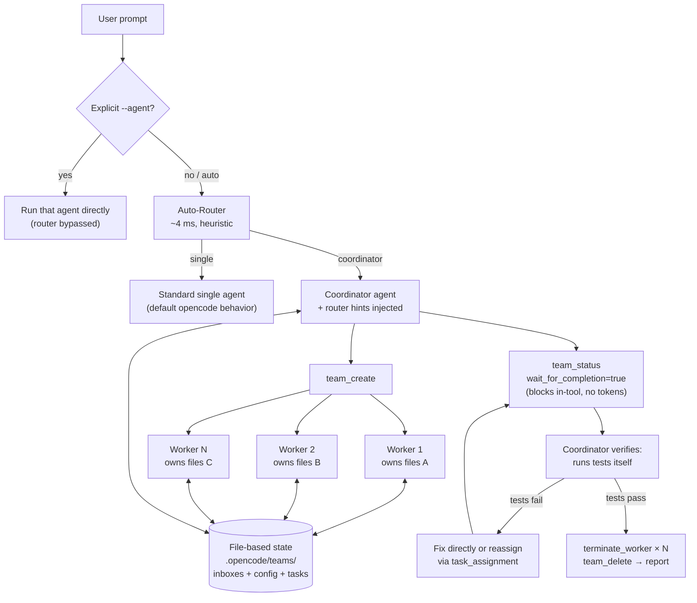
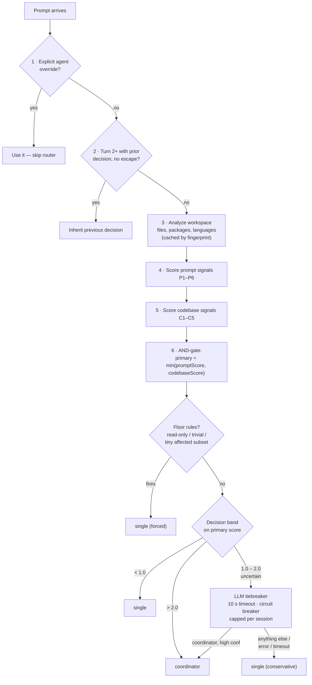
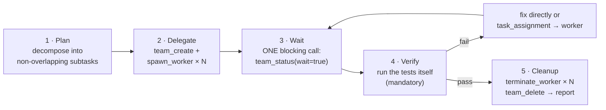
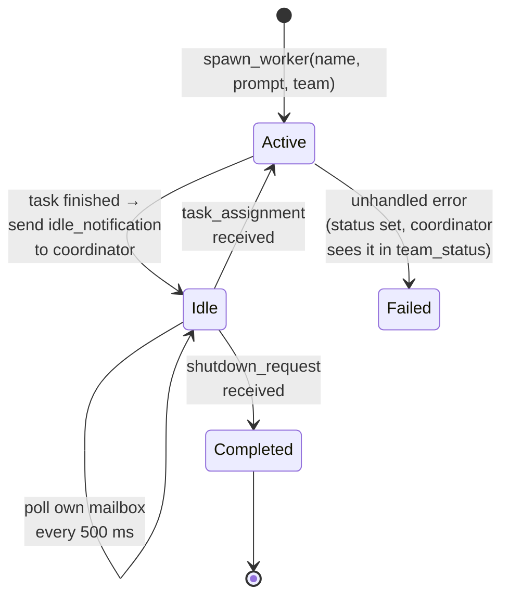
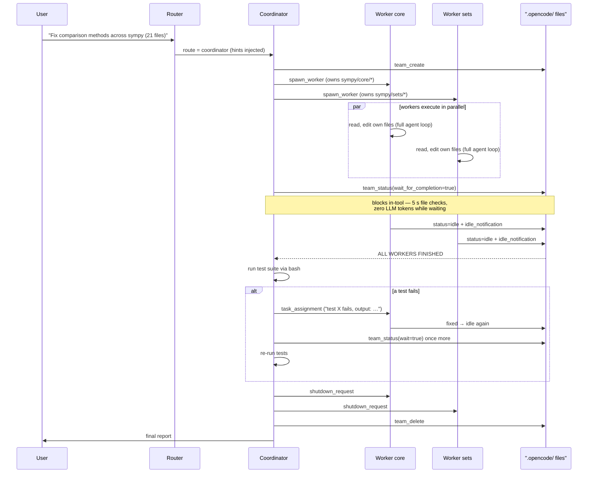

# OpenCode Multi-Agent Team System

**Branch**: `feature/multi-agent` · **Status**: research prototype, validated on SWE-bench instances · **Last verified**: 2026-08-11 (build passing, 266/267 tests green)

This document is the front door for anyone new to the project. It explains what the system is, why it exists, how the three core components (router, coordinator, workers) work in depth, what the experiments showed, and how to install and run it.

---

## Table of Contents

1. [TL;DR](#tldr)
2. [The Problem](#the-problem)
3. [Objective](#objective)
4. [The Approach](#the-approach)
5. [System Architecture](#system-architecture)
6. [Deep Dive: The Router](#deep-dive-the-router)
7. [Deep Dive: The Coordinator](#deep-dive-the-coordinator)
8. [Deep Dive: The Workers](#deep-dive-the-workers)
9. [On-Disk State](#on-disk-state)
10. [Why Multi-Agent Wins (When It Wins)](#why-multi-agent-wins-when-it-wins)
11. [Experimental Results](#experimental-results)
12. [Design Posture: How Invasive Is This?](#design-posture-how-invasive-is-this)
13. [Project Status](#project-status)
14. [Getting Started](#getting-started)
15. [Further Reading](#further-reading)

---

## TL;DR

This project extends [opencode](https://github.com/anomalyco/opencode) with **agent teams**: a coordinator agent that decomposes a large coding task, spawns background worker agents that each own a disjoint slice of the files, waits for them with a cheap blocking call (no LLM polling), verifies the result by running the tests itself, and cleans up.

On a 21-file SWE-bench Verified task (`sympy__sympy-13091`, GLM-5, 3 runs each), the team approach was on average **1.54× faster** and **11.7× cheaper in tokens** than a single agent, with both approaches at a 100% resolve rate.

An **auto-router** sits in front: it scores every incoming prompt against the workspace and decides — in ~4 ms, usually with zero extra LLM calls — whether the task should run as a normal single agent or escalate to the coordinator. Users never have to pick a mode manually.

---

## The Problem

A single coding agent working on a large, multi-file task hits three walls:

1. **Serial wall-clock time.** Independent changes (fix `core/`, fix `sets/`, fix `geometry/`) execute one after another even though nothing about the task requires it.

2. **Context degradation.** Every file the agent reads and edits stays in its context window. By file 12 of a 21-file refactor, the agent is dragging along thousands of lines of earlier diffs. In our experiments this is where single agents started producing circular imports, wrong fixes, and even syntax errors (see [Round 1 results](#round-1-glm-45-air)).

3. **Token cost scales superlinearly.** Because context accumulates, every subsequent step re-pays for everything that came before. Our single-agent runs on the 21-file task burned 5–7.5M tokens; workers with small, focused contexts did the same job in 0.2–1.2M.

There is also an inverse problem: **most tasks don't need a team.** Team setup costs 70–100 seconds of overhead. A system that spawns workers for a typo fix is worse than no system at all. So mode selection itself must be solved, cheaply, on every prompt.

## Objective

Build a multi-agent execution layer for opencode that:

- Runs genuinely parallel workers on non-overlapping partitions of a task
- Coordinates them with **near-zero token overhead** (no LLM-driven polling loops)
- Keeps each worker's context small and focused (the quality win, not just the speed win)
- Selects between single-agent and multi-agent mode **automatically**, erring toward the cheaper mode
- Changes nothing about opencode's behavior for users who don't opt in

## The Approach

Three components, split by what kind of decision they make:

| Component | Kind of logic | Decides |
|---|---|---|
| **Router** | Deterministic code (heuristics + optional LLM tiebreaker) | *Should this prompt run single-agent or coordinator?* |
| **Coordinator** | LLM with a strict workflow prompt | *How do I partition the work? How many workers? Is the result correct?* |
| **Workers** | LLM agents with an idle/resume lifecycle | *Execute one focused subtask at a time on files I own* |

Four design principles run through everything:

1. **File-based coordination.** Teams, inboxes, and shared task lists are plain JSON files on disk under `.opencode/`. No message broker, no database, no new dependencies. Any process that can read a file can participate.
2. **Completion detection at the tool level, not the prompt level.** Telling an LLM "don't poll too often" does not work (we measured it: 115 polling calls, 93% of wall time). A tool parameter that *blocks inside the tool* until workers finish is deterministic and cannot be ignored.
3. **AND-gate escalation.** Multi-agent mode requires *both* an ambitious prompt *and* a workspace with parallelism potential. Either one alone stays single-agent.
4. **Fail open.** Any router error, timeout, or budget breach falls back to the default single agent. Routing can never break a turn.

---

## System Architecture



---

## Deep Dive: The Router

Code: `packages/opencode/src/agent/router.ts` (decision pipeline) and `packages/opencode/src/agent/router/` (signals, integration, telemetry). Full spec: `docs/superpowers/specs/2026-04-23-opencode-auto-router-design.md`.

The router runs inside `createUserMessage` in `src/session/prompt.ts` on every prompt where the agent is omitted or set to `auto`. Its job: **pick the cheapest mode that will actually do the work.**

### The decision pipeline



### Prompt signals — "is the ask ambitious?"

| Signal | What it measures | Cap | Weight |
|---|---|---|---|
| **P1** | Glob patterns in the prompt (`**/*.ts`, `*.{ts,tsx}`) | 3 | 1 |
| **P2** | How many of the workspace's *actual package names* the prompt mentions | 4 | 1 |
| **P3** | Scope keywords ("all", "every", "across", "entire") — **only counted if a mutation verb is also present**, so "explain all the tests" scores 0 | 3 | **2** |
| **P4** | Conjunction chains — "do X *and* Y *then* Z" where 2+ clauses contain mutation verbs | 3 | 1 |
| **P5** | Explicit file paths in the prompt | 4 | 0.5 |
| **P6** | Task archetype modifier — read-only prompts *subtract* | — | −1 |

Mutation verbs (`refactor`, `migrate`, `rename`, `update`, `add`, `remove`, …) act as a gate in several signals: scope words without a mutation verb are just conversation, not a work order.

The prompt is also classified into a **task archetype** — `read-only`, `trivial`, `mutating-narrow`, or `mutating-broad` — used by the floor rules below.

### Codebase signals — "does the workspace support parallelism?"

| Signal | What it measures | Banding / weight |
|---|---|---|
| **C1** | Total file count | bands at 50 / 200 / 1000 → 0–3, weight 1 |
| **C2** | Package count | bands at 2 / 4 / 8 → 0–3, weight 1 |
| **C3** | Estimated size of the *affected subset* (mentioned packages × avg files/package) | bands at 5 / 16 / 40 → 0–3, weight 1 |
| **C4** | Cross-package breadth: prompt names **≥ 2 distinct packages** | 0 or 2, weight **2** |
| **C5** | Multi-language workspace | 0 or 1, weight 1 |

The workspace scan excludes `node_modules`, caches results keyed by a structural fingerprint, and measured at **p95 ≈ 6 ms** even on ~1000-file repos.

### The AND-gate and decision bands

Both weighted sums normalize to [0, 10], then:

```
primaryScore = min(promptScore, codebaseScore)
```

Coordinator mode requires **both** dimensions to be high. "Refactor everything" in a 30-file single-package repo → single (codebase is the min). "Fix this typo" in a 20-package monorepo → single (prompt is the min).

| `primaryScore` | Decision |
|---|---|
| < 0.5 | single, high confidence |
| 0.5 – 1.0 | single, medium |
| 1.0 – 2.0 | **uncertain → LLM tiebreaker** |
| 2.0 – 3.0 | coordinator, medium |
| ≥ 3.0 | coordinator, high |

**Floor rules override bands**: `read-only` or `trivial` archetype always forces single; so does a tiny affected subset combined with a low prompt score.

### The LLM tiebreaker

Only the uncertain band spends an LLM call: a small classifier (frozen prompt, hashed into the decision version) with a 10-second timeout, a max-calls-per-session budget, and a circuit breaker (5 consecutive failures → 60 s cooldown). Its output is mapped conservatively — only a *high-confidence* "coordinator" verdict actually escalates; everything else, including errors and timeouts, resolves to single. Disable it entirely in `weights.json` (`"tiebreaker": { "enabled": false }`) for a 100% heuristic router.

### Inheritance, announce, and introspection

- **Inheritance**: from turn 2 onward the session reuses its prior decision unless an escape condition fires (e.g. the workspace fingerprint changed), so a conversation doesn't flip modes mid-task.
- **Announce**: every routed turn surfaces a one-liner in all three frontends: `→ Routing: coordinator · 5 packages, 200 files`.
- **Telemetry**: every decision is logged to JSONL under `.opencode/` with daily rotation (content-free: no prompt text leaves the machine — verified by a privacy canary test).
- **Dry runs**: `opencode debug router "your prompt"` prints the full signal breakdown and the decision without running anything.

### Router hints → coordinator

When the route is coordinator, the router injects an advisory block into the coordinator's system prompt via a `{{ROUTER_HINTS}}` placeholder: the signals that fired, and (on the manual-override path) a suggested worker count of `min(packageCount, 4)` with a one-package-per-worker partition. The block is explicitly labeled *"advisory — override if you disagree"*, and hint tokens are length-bounded and control-character-scrubbed so a hostile `package.json` name can't steer the coordinator.

---

## Deep Dive: The Coordinator

Code: system prompt at `packages/opencode/src/agent/prompt/coordinator.txt`, registered as a built-in `coordinator` agent in `src/agent/agent.ts` with all team tools pre-allowed.

The coordinator is the one agent with a genuinely different *role*. It plans, delegates, waits, verifies, and cleans up — it does not do the parallel work itself (though it may fix small issues directly during verification, and in one observed run it adaptively started editing files itself when a worker was slow).



Key rules baked into the prompt (each one earned by a measured failure):

- **One worker per independent subtask, with non-overlapping file ownership.** The partition is the coordinator's main intellectual contribution; worker count follows from it. In practice: 3 workers for 3 independent modules, 4 workers for a 21-file, 6-module refactor.
- **One blocking wait, never a polling loop.** `team_status(wait_for_completion=true)` blocks inside the tool (5 s filesystem checks, 600 s timeout). On timeout it returns actionable options: keep waiting, or read the slow worker's files and finish the job yourself.
- **Verification is mandatory and personal.** The coordinator runs the task's test suite with bash after workers finish. It never wrote the parallel code, so it reviews with clean eyes.
- **Don't over-delegate.** Simple questions and single-file fixes are answered directly even in coordinator mode — a mis-route costs overhead, not correctness.

## Deep Dive: The Workers

Code: `packages/opencode/src/tool/spawn-worker.ts`.

Workers are **homogeneous by default**: each is an ordinary, full-capability opencode agent (default type `general`, same model as the parent) running in its own child session. What differentiates workers is *only the task prompt they receive* — this is **data parallelism over file partitions, not functional specialization**. (Heterogeneous teams are supported: `spawn_worker` accepts an `agent_type`, so a read-only `explore` researcher can serve alongside `general` implementers.)

`spawn_worker` does three things: creates a child session, registers the member in the team file, and forks a background lifecycle loop:



Two details matter:

- **Workers are persistent, not fire-and-forget.** After finishing, a worker goes idle and keeps polling its inbox. A follow-up `task_assignment` (say, "your file broke a test, here's the output") reuses the same session — the worker still has its partition's files in context. This is what makes it a *team* rather than a batch of subagents.
- **Workers know where they are.** Every prompt is prefixed with the project directory so a worker forked from a different process CWD still operates on the right repo (a real bug fixed in Sprint 5).

### The mailbox protocol

Agents are addressed as `name@team`. Each has a JSON inbox at `.opencode/teams/{team}/inboxes/{name}.json`, guarded by a reader-writer lock. Eight typed messages:

| Type | Direction | Purpose |
|---|---|---|
| `task_assignment` | coordinator → worker | New work for an idle worker |
| `idle_notification` | worker → coordinator | "Done, waiting" (includes a nudge to check `team_status`) |
| `shutdown_request` / `shutdown_approved` / `shutdown_rejected` | both | Graceful termination handshake |
| `plan_approval_request` / `plan_approval_response` | both | Optional plan-review handshake |
| `plain` | any | Free-form text (workers treat it as a task) |

### A full run, end to end



## On-Disk State

All coordination state is human-inspectable JSON — you can watch a run live with `cat`:

```
.opencode/
├── teams/{team-name}/
│   ├── config.json           # team: name, coordinator, members[] with status
│   └── inboxes/
│       ├── coordinator.json  # coordinator's message inbox
│       ├── worker1.json      # each worker's inbox
│       └── worker2.json
├── tasks/{team-name}/
│   └── tasks.json            # shared task list: status, owner, blockedBy[]
└── router/                   # JSONL decision telemetry (daily rotation)
```

Concurrent access goes through the existing reader-writer lock in `src/util/lock.ts`. No external dependencies were added.

---

## Why Multi-Agent Wins (When It Wins)

Three mechanisms, each observed and measured:

1. **Wall-clock parallelism.** Disjoint partitions genuinely execute concurrently. Average 1.54× faster on the 21-file benchmark.
2. **Fresh, bounded context per worker — the underrated one.** A single agent editing 12+ files accumulates every prior diff in context and starts making errors (wrong fix in one run, `IndentationError` in another). Workers touching 2–5 files each stayed correct. Bounded context is also why tokens collapsed 11.7×: each worker only ever re-reads its own slice.
3. **Failure isolation + a dedicated verifier.** A crashed worker flips to `failed` where the coordinator can see it and reassign; the coordinator verifies code it didn't write.

And one mechanism that had to be *removed* to get there:

> **The polling lesson.** In early runs the coordinator polled `check_mailbox` in a loop — 115 calls in one run, each a full LLM inference round (~15 s, ~24K tokens), consuming **93% of wall time**. Prompt-level limits ("don't poll more than 5 times") were ignored. The fix was architectural: a `wait_for_completion` parameter that blocks *inside* the tool with cheap filesystem checks. Token usage per run dropped from ~7.8M to 0.2–1.2M. **Never let an LLM poll; make the tool wait.**

---

## Experimental Results

All experiments used opencode built from this branch, with GLM-4.5-air and GLM-5 via the Z.AI Coding Plan. SWE-bench tasks are from **SWE-bench Verified**, checked against the official FAIL_TO_PASS tests.

### Case study 1 — Toy task: 3 independent Python modules (GLM-4.5-air)

Build Matrix, TextAnalyzer, FileManager classes + tests; zero interdependencies.

| Metric | Single agent | Multi-agent (3 workers) |
|---|---|---|
| Wall-clock | 240 s | **176 s (27% faster)** |
| Modules created | 3/3 | 3/3 |
| Tokens | 661K | 1,211K |

Genuine parallelism (2 workers finished before the 3rd), but on a small task the team overhead means more tokens. Multi-agent is *not* free.

### Case study 2 — SWE-bench `sympy__sympy-16597`, 6 files (GLM-4.5-air)

| Metric | Single agent | Multi-agent (3 workers) |
|---|---|---|
| Resolved | **YES (3/3 tests)** | **YES (3/3 tests)** |
| Wall-clock | **172 s** | 213 s |
| Tokens | 778K | 787K |

Both resolve it; single agent wins on a medium task. This calibrates the crossover point (below).

### Case study 3 — SWE-bench `sympy__sympy-13091`, 21 files across 6 modules

The headline benchmark: make comparison methods return `NotImplemented` across the codebase.

#### Round 1: GLM-4.5-air

| Metric | Single (run 1) | Single (run 2) | Multi (4 workers) |
|---|---|---|---|
| Result | **FAILED** — wrong fix | **BROKEN** — IndentationError | **2/2 tests PASSED** |
| Time | 596 s | 881 s | 1297 s |
| Tokens | 3,648K | 6,779K | 7,846K |

With the small model, multi-agent was the *only* configuration that produced working code — context degradation broke both single-agent runs. But the multi run was slow and expensive, which exposed…

#### Round 2: GLM-5, before the coordinator fix

The coordinator got stuck in an infinite `check_mailbox` polling loop — **115 calls** — and never reached verification. Run killed at 863 s, unresolved.

#### Round 3: GLM-5, after adding `team_status` + prompt rewrite

| Metric | Single | Multi (fixed) |
|---|---|---|
| Resolved | YES | YES |
| Time | 2965 s | **1516 s (1.95× faster)** |
| Tokens | 7,541K | **2,305K (3.3× cheaper)** |
| Polling calls | — | 30 (down from 115) |

#### Round 4: GLM-5, blocking `team_status` — balanced 3v3 comparison

`wait_for_completion=true` moves the wait inside the tool. Three runs per mode:

| Run | Mode | Time | Tokens | Resolved |
|---|---|---|---|---|
| H1 | Single | 2965 s | 7,541K | YES |
| H1b | Single | 2514 s | 7,209K | YES |
| H1c | Single | 2333 s | 4,913K | YES |
| I2 | Multi | 1414 s | 1,194K | YES |
| I3 | Multi | 2203 s | 235K | YES |
| I4 | Multi | 1441 s | 247K | YES |

| Summary (n=3 each) | Single | Multi | Improvement |
|---|---|---|---|
| Resolve rate | 3/3 | 3/3 | — |
| Avg time | 2604 s (43 min) | 1686 s (28 min) | **1.54× faster** |
| Avg tokens | 6,554K | 559K | **11.7× cheaper** |

### The crossover rule of thumb

| Task size | Recommendation |
|---|---|
| < 5 files | **Single agent** — team overhead exceeds savings |
| 5–10 files | Tie — depends on how independent the changes are |
| > 10 files | **Multi-agent** — faster, cheaper, *and* more reliable (context stays bounded) |
| Sequential dependencies throughout | Single agent — nothing to parallelize |

The auto-router encodes exactly this intuition in its signals and bands.

### Router validation

The router has its own test evidence (see `docs/superpowers/plans/2026-04-24-auto-router-test-results.md`): 218 tests across 22 files, including a 50-prompt labeled calibration fixture gated by a Wilson lower-confidence-bound accuracy check, cold/warm latency regression tests (p95 ≈ 6 ms cold, ≈ 2 ms warm), classifier fault-injection/resilience tests, and a privacy canary proving prompt text never reaches telemetry. A 15/15 smoke match on real repos and a minimal A/B/C comparison on `sympy-16597` confirmed end-to-end behavior.

---

## Design Posture: How Invasive Is This?

The implementation is **layered, mostly additive** — built as an integration, not a fork-mutation. Behavior for users who never pick `coordinator` or `auto` is unchanged.

| Tier | What | Coupling to opencode |
|---|---|---|
| Coordination modules (`mailbox/`, `team/`, `team-task/`, `notification/`) | Plain JSON-on-disk protocol | **None** — portable as-is (only `Bun.file`/`Bun.write` to swap) |
| 13 tools | Thin `Tool.define`/Effect/zod shells around tier-1 calls | Mechanical rewrite per host |
| Core hooks | `fork()` on `TaskPromptOps` (1 line in `session/prompt.ts`), `run_in_background` on the task tool, tool + agent registration (~125 lines total) | **Deep** — relies on opencode's child sessions, `ops.prompt()` agent loop, and Effect runtime |
| Auto-router | Intercepts `createUserMessage` on every prompt; UI changes in TUI + Desktop pickers | Invasive by nature — must sit where agent selection happens |

**Porting to another coding agent** (Codex-style CLIs, Kilo Code, etc.): the file protocol, coordinator prompt, message taxonomy, and design lessons transfer directly. The execution binding does not — the host needs custom tools, custom system prompts, and some way to run an agent loop in the background. The cleanest path to true portability would be repackaging the tools as an **MCP server** and spawning workers as **headless CLI subprocesses**, since the file-based state layer already works across processes. That re-architecture is future work.

---

## Project Status

**Done** (April 2026, ~82 commits, ~12.7K lines):

- Sprints S1–S9: background execution → mailbox → teams + shared tasks → coordinator agent → five rounds of review fixes → `team_status` → blocking wait
- Auto-router: full signal pipeline, LLM tiebreaker with circuit breaker, session inheritance, announce across CLI/TUI/Desktop, JSONL telemetry, `opencode debug router`, calibration + latency + resilience test suites
- Evaluation: 3 case studies including a balanced 3v3 SWE-bench comparison

**Verified 2026-08-11**: build succeeds with smoke test; router tests 218/218; multi-agent tests 48/49 — the one failure is a stale assertion in `test/integration/multiagent.test.ts` (TC-4.2 expects strings removed from `coordinator.txt` in the S9 prompt rewrite), not a functional bug.

**Known gaps / future work**:

- `suggestedWorkerCount`/`suggestedPartition` hints are only populated on the manual-override path; the heuristic-routing path passes only fired signals (the coordinator picks the count itself — it did so well in evals, but the hint plumbing is incomplete)
- Upstream `origin/dev` has drifted ~3,700 commits ahead of this branch's April 2026 branch point; the new-file code will rebase cleanly but the wiring points (`session/prompt.ts`, `tool/registry.ts`, `tool/task.ts`, `agent/agent.ts`) are hot upstream files and will conflict
- Single-machine only: workers are in-process forks; the MCP-server + subprocess re-architecture would enable cross-process and cross-agent teams
- Worker-count cap and partition quality rely on coordinator judgment; no hard budget enforcement per team

---

## Getting Started

### Prerequisites

- [Bun](https://bun.sh) ≥ 1.3.x (the repo pins `bun@1.3.11`)
- Git
- An LLM provider account (any provider opencode supports; the experiments used Z.AI's GLM models)

### Download and install

```bash
git clone https://github.com/cychong87/opencode.git
cd opencode
git checkout feature/multi-agent
bun install
```

### Configure a model provider

```bash
bun dev auth   # alias for `opencode providers` — interactive credential setup
```

The router's LLM tiebreaker and all agents use whatever provider/model you configure here.

### Run — option A: dev mode (fastest iteration)

From the repo root; `bun dev` is an alias for running `packages/opencode/src/index.ts`:

```bash
bun dev                                            # interactive TUI (agent picker defaults to "auto")
bun dev run "your prompt"                          # one-shot, auto-routing decides the mode
bun dev run --agent coordinator "your prompt"      # force multi-agent mode
bun dev run --agent build "your prompt"            # force a specific single agent (bypasses router)
bun dev debug router "refactor all packages"       # dry-run: full signal breakdown, no execution
```

> Note: dev mode changes the process working directory to `packages/opencode`. For real tasks on another project, prefer the built binary.

### Run — option B: built binary (what the benchmarks used)

```bash
cd packages/opencode
bun run build --skip-embed-web-ui
# binary lands in dist/<platform>/bin/opencode, e.g. on Apple Silicon:
./dist/opencode-darwin-arm64/bin/opencode run --agent coordinator "your prompt"
```

### Try the canonical multi-agent demo

```bash
./dist/opencode-darwin-arm64/bin/opencode run --agent coordinator \
  "Build 3 independent Python modules: a Matrix class, a TextAnalyzer class, and a
   FileManager class. Each has its own source file and test file, zero dependencies
   on each other. Use spawn_worker to build all 3 in parallel."
```

Watch the team state live from another terminal: `cat .opencode/teams/*/config.json`.

### Run the tests

```bash
cd packages/opencode
bun test                                   # full suite
bun test test/router/                      # router only (218 tests)
bun test test/mailbox/ test/team/ test/team-task/ test/notification/ test/integration/
                                           # multi-agent only (49 tests)
```

---

## Further Reading

| Document | What it covers |
|---|---|
| [`packages/opencode/MULTI_AGENT_README.md`](../../packages/opencode/MULTI_AGENT_README.md) | Original feature README: tools reference, full evaluation tables, commit history |
| [`packages/opencode/src/agent/router/README.md`](../../packages/opencode/src/agent/router/README.md) | Router user + contributor guide with worked decision examples |
| [`docs/superpowers/specs/2026-04-23-opencode-auto-router-design.md`](../superpowers/specs/2026-04-23-opencode-auto-router-design.md) | Full router architectural spec |
| [`docs/superpowers/plans/2026-04-24-auto-router-test-results.md`](../superpowers/plans/2026-04-24-auto-router-test-results.md) | Router validation results (Phases A–H) |
| `packages/opencode/src/agent/prompt/coordinator.txt` | The coordinator's actual system prompt |
